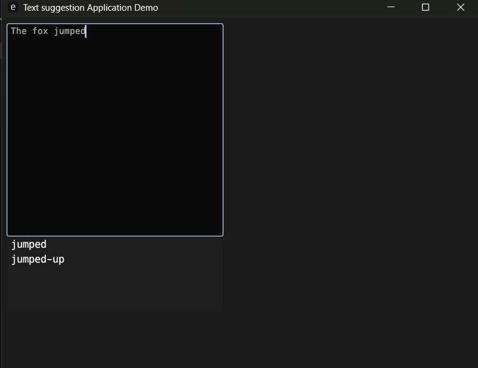

# Auto Complete GUI demonstration in Rust 

* A simple Rust based Text suggestion Demo that provides text suggestions to entered text.
* Text suggestions based on Trie Data Structure


 

 

## Getting started

### Dev Build

#### To build the project
```bash
cargo build
```

#### To run project in Debug Mode

```bash
cargo run
```


#### To run project in Release Mode

```bash
cargo run --release
```

## Further Development
- [ ] Optimization, for smoother interface, currently runs faster in release builds.
- [ ] Press Tab to Accept selected suggestion.


